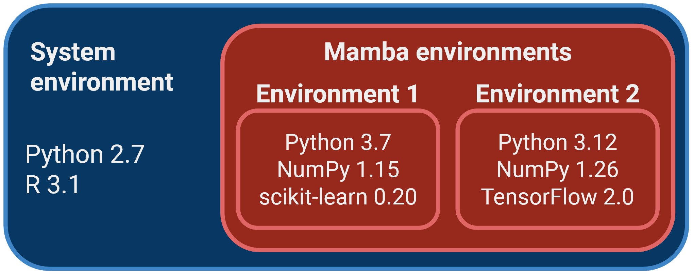

# Package Managers

:::{.callout-tip}
#### Learning objectives

- Describe the role of a package manager and list examples of package managers for different applications.
- Recognise the challenges in managing complex software environments and the role of the Conda/Mamba package manager in solving these.
- Create and use reproducible software environments using Mamba. 
- Recognise some of limitations of Mamba as a package manager and how to avoid common pitfalls. 

:::

## What is a package manager?

Most operating systems have **package managers** available, which allow the user to manage (install, remove, upgrade) their software easily. 
The package manager takes care of automatically downloading and installing the software we want, as well as any dependencies it requires.

, licensed under [CC BY-SA 4.0](https://itsfoss.com/copyright/)](https://itsfoss.com/content/images/wordpress/2020/10/linux-package-manager-explanation.png)

There are many package managers available, some are specific to a given type of operating system, or specific to a programming language, while others are more generic.
Each of these package managers will use their own repositories, meaning they have access to different sets of software (although there is often some overlap). 
Some examples include: 

- `apt` is the default _Linux_ package manager for Debian-derived distributions, such as the popular Ubuntu. It comes pre-installed and can be used to install system-level applications.
- `homebrew` is a popular package manager for macOS, although it also works on Linux.
- `conda`/`mamba` is a package manager very popular in bioinformatics and data science communities, due to the repositories which give access to software used in these fields. It will be the main focus of this section.

Some programming languages also come with their own package managers.
For example: 

- The statistical software **R** has two main library repositories: [CRAN](https://cran.r-project.org/web/packages/) and [Bioconductor](https://bioconductor.org/). These are installed from within the R console using the commands `install.packages()` and `BiocManager::install()`, respectively. 
- The programming laguage **Python** has a package manager called `pip`, which has access to the Python Package Index (PyPI) repository.

In many cases package managers can also install software directly from code repositories such as GitHub, adding further flexibility to how we manage our scientific software. 


## Conda/Mamba

A popular package manager in data science, scientific computing and bioinformatics is **Mamba**, which is a successor to another package manager called Conda.

Conda was originally developed by [Anaconda](https://anaconda.org/) as a way to simplify the creation, distribution, and management of software environments containing different packages and dependencies. 
It is known for its cross-platform compatibility and relative ease of use (compared to compiling software and having the user manually install all software dependencies). 
Mamba is a more recent and high-performance alternative to Conda. 
While it maintains compatibility with Conda's package and environment management capabilities, Mamba is designed for **faster dependency resolution and installation**, making it a better choice nowadays. 
Therefore, the rest of this section focuses on Mamba specifically.

One of the strengths of using Mamba to manage your software is that you can have different versions of your software installed alongside each other, organised in **environments**. 
Organising software packages into environments is extremely useful, as it allows to have a _reproducible_ set of software versions that you can use and reuse in your projects. 

For example, imagine you are working on two projects with different software requirements:

- Project A: requires Python 3.7, NumPy 1.15, and scikit-learn 0.20.
- Project B: requires Python 3.12, the latest version of NumPy, and TensorFlow 2.0.

If you don't use environments, you would need to install and maintain these packages globally on your system. 
This can lead to several issues:

- **Version conflicts:** different projects may require different versions of the same library. For example, Project A might not be compatible with the latest NumPy, while Project B needs it.
- **Dependency chaos:** as your projects grow, you might install numerous packages, and they could interfere with each other, causing unexpected errors or instability.
- **Difficulty collaborating:** sharing your code with colleagues or collaborators becomes complex because they may have different versions of packages installed, leading to compatibility issues.



**Mamba allows you to create self-contained software environments for each project**, addressing these issues:

- **Isolation:** you can create a separate environment for each project. This ensures that the dependencies for one project don't affect another.
- **Software versions:** you can specify the exact versions of libraries and packages required for each project within its environment. This eliminates version conflicts and ensures reproducibility.
- **Ease of collaboration:** sharing your code and environment file makes it easy for collaborators to replicate your environment and run your project without worrying about conflicts.
- **Simplified maintenance:** if you need to update a library for one project, it won't impact others. You can manage environments separately, making maintenance more straightforward.

Another advantage of using Mamba is that the **software is installed locally** (by default in your home directory), without the need for admin (`sudo`) permissions. 

:::{.callout-note}
#### How do I install Mamba?

We give instructions to install Mamba on our [setup page](../setup.md#conda).
:::

### Installing software with Mamba

You can search for available packages from the [anaconda.org](https://anaconda.org/) website. 
Packages are organised into "channels", which represent communities that develop and maintain the installation "recipes" for each software. 
The most popular channels for bioinformatics and data analysis are "**bioconda**" and "**conda-forge**". 

There are three main commands to use with Mamba:

- `mamba create -n ENVIRONMENT-NAME`: this command creates a new software environment, which can be named as you want. Usually people name their environments to either match the name of the main package they are installing there (e.g. an environment called `pangolin` if it's to install the _Pangolin_ software). Or, if you are installing several packages in the same environment, then you can name it as a topic (e.g. an environment called `rnaseq` if it contains several packages for RNA-seq data analysis).
- `mamba install -n ENVIRONMENT-NAME  NAME-OF-PACKAGE`: this command installs the desired package in the specified environment. 
- `mamba activate ENVIRONMENT-NAME`: this command "activates" the environment, which means the software installed there becomes available from the terminal. 

Let's see a concrete example. 
If we wanted to install packages for phylogenetic analysis, we could do: 


```bash
# create an environment named "phylo"
mamba create -n phylo

# install some software in that environment
mamba install -n phylo iqtree==2.3.3 mafft==7.525
```

If we run the command: 

```bash
mamba env list
```

We will get a list of environments we created, and "phylo" should be listed there. 
If we want to use the software we installed in that environment, then we can activate it: 

```bash
mamba activate phylo
```

And usually this changes your terminal to have the word `(phylo)` at the start of your prompt instead of `(base)`. 


### Environment files

Although we can create and manage environments as shown above, it may sometimes be useful to specify an environment in a file. 
This is particularly useful if you want to document how your environment was created and if you want to recreate it somewhere else. 

Environments can be defined using a specification file in [YAML format](https://en.wikipedia.org/wiki/YAML) (a simple text format often used for configuration files). 
For example, our phylogenetics environment above could be specified as follows:

```yml
name: phylo
channels:
  - conda-forge
  - bioconda
dependencies:
  - iqtree==2.3.3
  - mafft==7.525
```

We have included this example in the file `demo/envs/phylo.yml`.
To create the environment from the file, we can use the command: 

```bash
mamba env create -f envs/phylo.yml
```

Note that this command is slightly different from the one we saw earlier: `mamba env create -f environment.yml` as shown here is to create an environment from a file, whereas `mamba create -n name-of-environment` that we saw earlier is used to create a new environment from scratch.

If you later decide to update the environment, either by adding a new software or by updating the software versions, you can run the command: 

```bash
mamba env update -f envs/phylo.yml
```

You can practice this in an exercise below.

:::{.callout-note}
#### Create a YAML file from an existing environment

If you did not create an environment file at the start of your project, you can create one from an existing environment using the command `mamba env export > env.yaml`
:::


## Disadvantages and pitfalls

### Dependency conflicts {.unnumbered .unlisted}

One thing to be very careful about is how Conda/Mamba manages the dependency graph of packages to install. 
If you don't specify the version of the software you want, in theory Mamba will pick the latest version available on the channel. 
However, this is conditional on the other packages that are installed alongside it, as some versions may be incompatible with each other, it may downgrade some packages without you realising. 

<!-- 
mamba install -n metagen fastqc==0.12.1 multiqc==1.24.1 cutadapt==4.9 trimmomatic==0.39 bowtie2==2.5.4 samtools==1.21 metaphlan==4.1.1 mash==2.3 spades==4.0.0 bbmap==39.08 flash==1.2.11 maxbin2==2.2.7 prokka==1.14.6 gtdbtk==2.4.0 abricate==1.0.1 checkm-genome==1.2.3
-->

Take this example, where we create a new environment called `metagen` for a metagenomics project. 
We initiate the environment with only two packages: GTDB-tk (taxonomic classification of genomes) and MultiQC (quality control reporting tool): 

```bash
mamba create -n metagen multiqc gtdbtk
```

When you run this command, Mamba will ask if you want to proceed with the installation. 
Before proceeding, it's always a good idea to **check which versions of the packages we are interested in are being installed**. 

At the time of writing, the [latest version of GTDB-tk on anaconda.org](https://anaconda.org/bioconda/gtdbtk) is 2.4.0, however as we run this command we can see that Mamba is installing version 2.3.0, which is a version behind the latest.

Let's be more explicit and specify we want the latest versions available for both packages (at the time of writing): 

```bash
mamba create -n metagen multiqc==1.28 gtdbtk==2.4.0
```

By running this command, we get an error message informing us that Mamba could not find a fully compatible environment for these software versions. 
The message is very long, we only show the top few lines:

```
Could not solve for environment specs
The following packages are incompatible
├─ gtdbtk 2.4.0  is installable with the potential options
│  ├─ gtdbtk 2.4.0 would require
│  │  ├─ fastani 1.32.* , which requires
│  │  │  └─ boost >=1.70.0,<1.70.1.0a0  with the potential options
│  │  │     ├─ boost 1.70.0 would require
│  │  │     │  └─ python >=2.7,<2.8.0a0 , which can be installed;
│  │  │     ├─ boost 1.70.0 would require
│  │  │     │  └─ python >=3.6,<3.7.0a0 , which can be installed;
│  │  │     ├─ boost 1.70.0 would require
│  │  │     │  └─ python >=3.7,<3.8.0a0  with the potential options
│  │  │     │     ├─ python [3.7.0|3.7.1|...|3.7.9], which can be installed;
│  │  │     │     └─ python [3.7.10|3.7.12] would require
│  │  │     │        └─ python_abi 3.7.* *_cp37m, which can be installed;

... etc ...
```

The message is a bit hard to interpret, but generally we can see that the issue seems to be related to the Python versions required by these two packages. 

How could we solve this problem? 
One possibility is to **install each software in a separate environment**. 
The disadvantage is that you will need to run several `mamba activate` commands at every step of your analysis. 

Another possibility is to **find a compatible combination of package versions** that is sufficient for your needs.
For example, let's say that GTDB-tk was the most critical software for which we needed to run the latest version. 
We could find what is the latest version of MultiQC compatible with it, by forcing the GTDB-tk version, but not the other one: 

```bash
mamba create -n metagen multiqc gtdbtk==2.4.0
```

Running this command, we can see that we would get `multiqc==1.21`. 
So, MultiQC would be a slightly older version than currently available, but for our purposes this might not be a problem. 
If we were happy with this choice, then we could proceed. 
For reproducibility, we could save all this information in a YAML file specifying our environment: 

```yaml
name: metagen
channels:
  - conda-forge
  - bioconda
dependencies:
  - multiqc==1.21
  - gtdbtk==2.4.0
```


### Package availability {.unnumbered .unlisted}

Some packages not available: 

- [Cell Ranger](https://www.10xgenomics.com/support/software/cell-ranger/latest) is a very popular software for processing single-cell RNA-seq data from the 10x genomics platform. However, the software is not open source and therefore not available through the bioconda channel. 
- Software that is not used by a wide-enough community, and thus has no available installation recipe. For example [AliView](https://ormbunkar.se/aliview/) (to visualise multiple sequence alignments) or [APAtrap](https://sourceforge.net/p/apatrap/wiki/User%20Manual/) (differential usage of alternative polyadenylation sites from RNA-seq).


### Disk space {.unnumbered .unlisted}

Environments can take a lot of disk space in your system. 
This is software-dependent, but in some cases can become quite substantial (several GB of files). 
Therefore, it's good practice to: 

- **Remove unused environments**: regularly check for environments that you no longer need and remove them using `mamba env remove --name ENV_NAME`. You can use `mamba env list` to list your environments and find unused ones. 
- **Recreate environments from YAML files**: related to the previous point, always make sure to keep YAML enviroment files for your environments. This way, you can safely remove less frequently used environments and later recreate them using `mamba env create -f env.yml`. If you did not create an environment file, you can create one from an existing environment with `mamba env export > env.yaml`.
- **Regularly clear cached packages**: Mamba caches downloaded packages for faster installation in the future. However, you can clear this cache using `mamba clean --all`. This is particularly useful after upgrades, as you don't need old versions of the packages stored in your system.

To see if this is a problem in your system, you can occasionally check the size of your Miniforge installation folder with the following command (assuming default installation path):

```bash
du --si -s $CONDA_PREFIX
```

Note the `$CONDA_PREFIX` is an environment variable that stores the directory path to your conda/mamba installation. 

::: {.callout-note}
#### Mixing package managers

There might be times when some packages/libraries are not available in a package manager. For example, it can be common to use conda/mamba but find a python library that is only available through `pip`. Unfortunately, this may cause issues in your environment as pip may change your conda-installed packages, which might break the conda environment. There are a few steps one can follow to avoid this pitfalls:

1. Start from a new and clean environment. If the new environment breaks you can safely remove it and start over. You can create a new environment from pre-existing ones if necessary. We will see more of this later.
2. Install `pip` in your conda environment. This is important as the pip you have in your base environment is different from your new environment (will avoid conflicts).
3. Install any conda packages your need to get the environment ready and leave the pip install for last. Avoid switching between package managers. Start with one and finish with the other one so reversing or fixing conflicts is easier.

You can find a (checklist)[https://www.anaconda.com/blog/using-pip-in-a-conda-environment] in the anaconda webpage for good practice.
:::


## Exercises

:::{.callout-exercise}
#### Creating a new Mamba environment

Go to the `demo` directory, where you will find some FASTQ files in the `reads` folder. 
The objective in this exercise is to setup a software environment to run a standard quality control software on these sequencing reads. 

- Use a text editor to create a Conda/Mamba environment file called `envs/qc.yml`. This file should specify: 
  - Environment name: `qc`
  - Channels: `conda-forge`, `bioconda`
  - Packages: FastQC v0.12.1 and MultiQC v1.21 (check available packages at [anaconda.org](https://anaconda.org/)).
- Using `mamba` build the environment from your created file.
- Activate your new environment and run the QC script provided: `bash scripts/01-qc.sh` (you can look inside the script to see what it is doing).
- Check if you obtained the final output file in `results/qc/multiqc_report.html`.

:::{.callout-answer}

We can see how to specify an environment file manually on the [Conda documentation page](https://conda.io/projects/conda/en/latest/user-guide/tasks/manage-environments.html#create-env-file-manually).
Following those instructions, we have created the following file and saved it as `envs/qc.yml`: 

```yml
name: qc
channels:
  - conda-forge
  - bioconda
dependencies:
  - fastqc==0.12.1
  - multiqc==1.21
```

We then created our environment with the command: 

```bash
mamba env create -f envs/qc.yml
```

We then activate our environment:

```bash
mamba activate qc
```

And finally ran the script provided: 

```bash
bash scripts/01-qc.sh
```

We can see the script ran successfully by looking at the output directory `results`.

:::
:::


:::{.callout-exercise}
#### Update a Mamba environment

Going back to the `envs/phylo.yml` environment (in the `demo` folder), update the environment to include a software to for dating phylogenetic trees called TreeTime.

- Go to [anaconda.org](https://anaconda.org/) to see what is the latest version available and from which channel.
- Update the YAML environment file to include it.
- Update the environment.
- Check if the software was installed successfully by running `treetime --version`.

::: callout-answer

We can see the software is available from https://anaconda.org/bioconda/treetime, provided from the bioconda channel.
The latest version at the time of writing is 0.11.3, so it is the one we demonstrate below. 

Using a text editor of our choice, we update our YAML file: 

```yml
name: phylo
channels:
  - conda-forge
  - bioconda
dependencies:
  - iqtree==2.3.3
  - mafft==7.525
  - treetime==0.11.3
```

After saving the changes, we update our environment: 

```bash
mamba env update -f envs/phylo.yml
```

Once the update runs successfully, we activate the environment first with `mamba activate phylo` and then test our software: 

```bash
treetime --version
```

```
treetime 0.11.3
```

The command runs successfully, with the expected version printed, indicating it is successfully installed. 

:::
:::


:::{.callout-exercise}
#### Package dependencies

A PhD student working on a machine learning project is trying to improve a classification model from a previous publication. 

For benchmarking purposes, the student wants to reproduce the previous analysis and therefore use the same version of the package used by the authors: **PyTorch version 1.5.0**.

For their own improved model, they will use a recent version of a different library: **TensorFlow version 2.17.0**. 

The student came to you for advice: they've heard of Mamba and would like to create an environment for their project. 
What would you recommend to them?

:::{.callout-answer}

We can start by running a command to create an environment with both packages, making sure we pin the specific versions required (we call the environment `ml` in this example, but you could name it anything you want): 

```bash
mamba create -n ml tensorflow==2.17.0 pytorch==1.5.0
```

However, we get a package dependency error: 

```
Could not solve for environment specs
The following packages are incompatible
├─ pytorch 1.5.0  is requested and can be installed;
└─ tensorflow 2.17.0  is uninstallable because it requires
   └─ tensorflow-base [2.17.0 cpu_py310h98e3cc3_1|2.17.0 cpu_py310h98e3cc3_2|...|2.17.0 cuda120py39hee30cbf_201], which requires
      └─ keras >=3.0  with the potential options
         ├─ keras [3.0.2|3.0.4|3.0.5|3.1.0] would require
         │  └─ tensorflow >=2.15.0,<2.17.0a , which can be installed;
         ├─ keras [3.1.0|3.1.1] would require
         │  └─ pytorch 2.1.* , which conflicts with any installable versions previously reported;
         ├─ keras [3.2.0|3.2.1|3.3.2|3.3.3|3.4.1] would require
         │  └─ pytorch >=2.1,<2.3 , which conflicts with any installable versions previously reported;
         └─ keras [3.0.5|3.4.1|3.5.0] would require
            └─ pytorch >=2.1.0 , which conflicts with any installable versions previously reported.
```

This is because PyTorch 1.5.0 is quite an old version, while TensorFlow 2.17.0 is quite a new version, leading to different version requirements. 
In fact, TensorFlow itself depends on PyTorch, but version 2.17 requires more recent versions of PyTorch than 1.5.

As there is no easy way to install both of these packages in the same environment, our best recommendation to the student would be to create two separate environments for these packages: 

```bash
mamba create -n pytorch pytorch==1.5.0
mamba create -n tensorflow tensorflow==2.17.0
```

In this case we simply named the environments after the main package we're installing, but again you could choose different names. 

Installing the packages in separate environments avoids the previous Python version conflict. 
:::
::: 


## Summary

::: callout-tip
#### Key points

- A package manager automates the process of installing, upgrading, configuring, and managing software packages, including their dependencies.
- Examples of package managers are `pip` (Python), `apt` (Debian/Ubuntu) and `conda`/`mamba` (generic).
- Dependency conflicts, which often arise in complex bioinformatic workflows, can be resolved by managing software in isolated environments. 
- Conda/Mamba simplify these tasks by managing dependencies, creating isolated environments, and ensuring reproducible setups across different systems.
- Key Mamba commands include:
  - `mamba create --name ENVIRONMENT-NAME` to create a new environment.
  - `mamba install -n ENVIRONMENT-NAME  NAME-OF-PACKAGE` to install a package inside that environment.
  - `mamba activate ENVIRONMENT-NAME` to make the software from that environment available.
  - `mamba env create -f ENVIRONMENT-YAML-SPECIFICATION` to create an environment from a YAML file (recommended for reproducibility).
  - `mamba env update -f ENVIRONMENT-YAML-SPECIFICATION` to update an environment from a YAML file (recommended for reproducibility).
- Recognise some of limitations of Mamba as a package manager and how to avoid common pitfalls. 
- There are some disadvantages/limitations of Mamba as a package manager: 
  - Dependencies aren't always respected.
  - Software versions are sometimes downgraded without explicit warning.
  - It can be slow at resolving very complex environments. 
:::